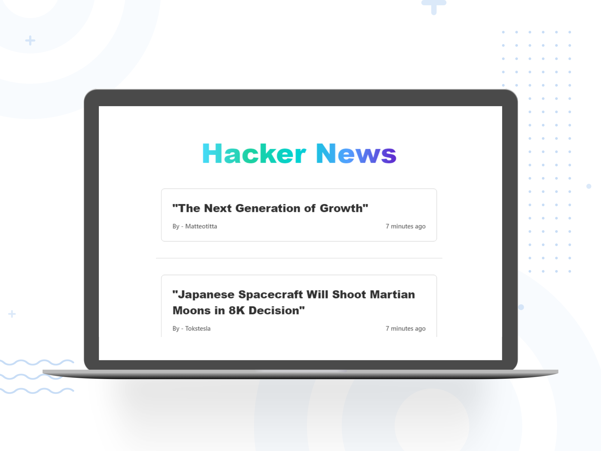
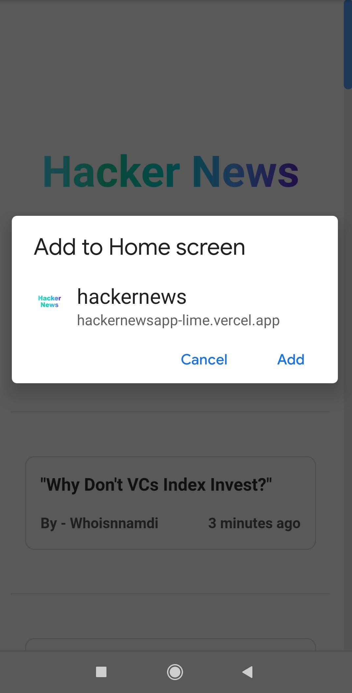
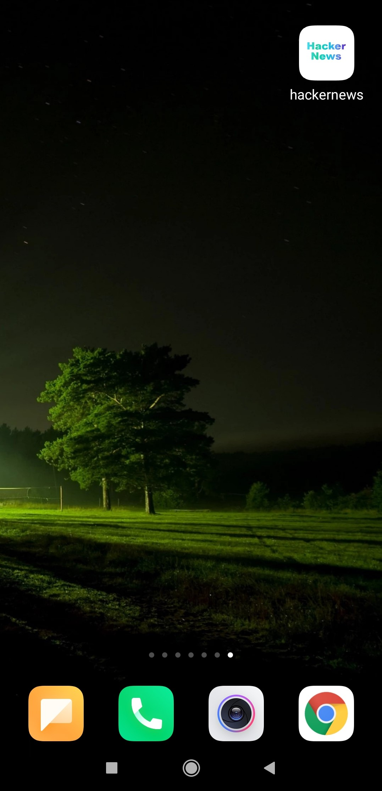
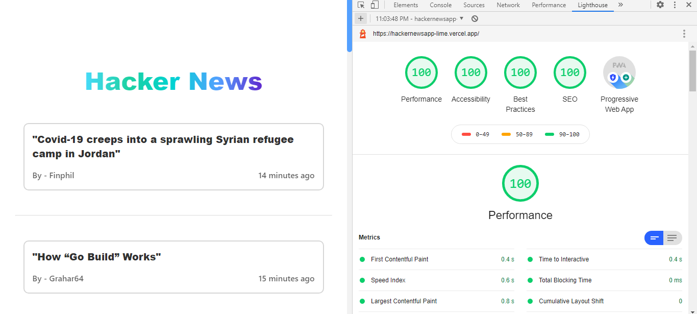
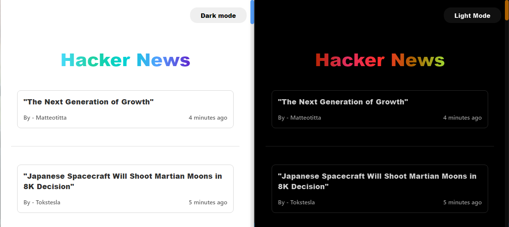
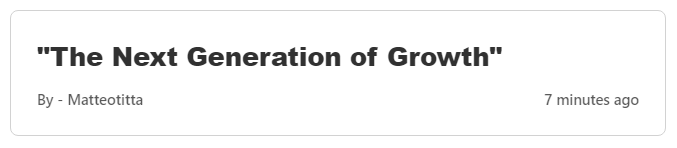

## Hacker News Reader

<a href="https://hackernewsapp-lime.vercel.app/">

</a>
<br/>
Hacker News Reader App - Read all the latest stories from the Hacker news API.
<br/>




## Development

### Setup

```bash
npm install
```

### Run the development server

```bash
npm run dev
```

Open [http://localhost:3000](http://localhost:3000) with your browser to see the result. The page auto-updates as you edit the file.

### Run the tests

```bash
npm run test
```

Tests with Coverage

```bash
npm run test:coverage
```

---

## Features

- Read latest stories from Hacker News
- Infinite scrolling with Content loaders
- Mobile Responsive
- Testing using jest and enzyme
<details><summary>PWA supported & Works offline too</summary>
<div style="display:inline">
       
    
</div>
</details>
<details><summary>Awesome score on Lighthouse</summary>
<ul>
    
</ul>
</details>
<details><summary>Dark and Light mode</summary>
<ul>
    
</ul>
</details>
<details><summary>Know how much time ago the stories were added</summary>
<ul>
    
</ul>
</details>

---

## Directory Structure

<details><summary>pages</summary>
<ul>
    <li>_app = Page initializations of the project</li></br>
    <li>_document = A custom Document is commonly used to augment your application's html and body tags.</li></br>
    <li>index.tsx = Home page of the app with all the stories</li>
</ul>
</details>

<details><summary>public</summary>
<ul>
    <li>Image files of logos and icons</li>
    <li>manifest.json file</li>
</ul>
</details>

<details><summary>src</summary>
<ul>
    <li>__tests__ = All the test files</li>
    <li>common = Commonly used files </li>
    <li>components = Modules of the Project </li>
    <li>utils = Utility functions</li>
</ul>
</details>

<details><summary>styles</summary>
<ul>
    <li>Styles for all the components</li>
</ul>
</details>

---

## Dependencies

- next-offline - Plugin needed to load the Service workers

- cross-env - Needed for offline support script, can be done using .env files but project is supposed to be easy to install and run
